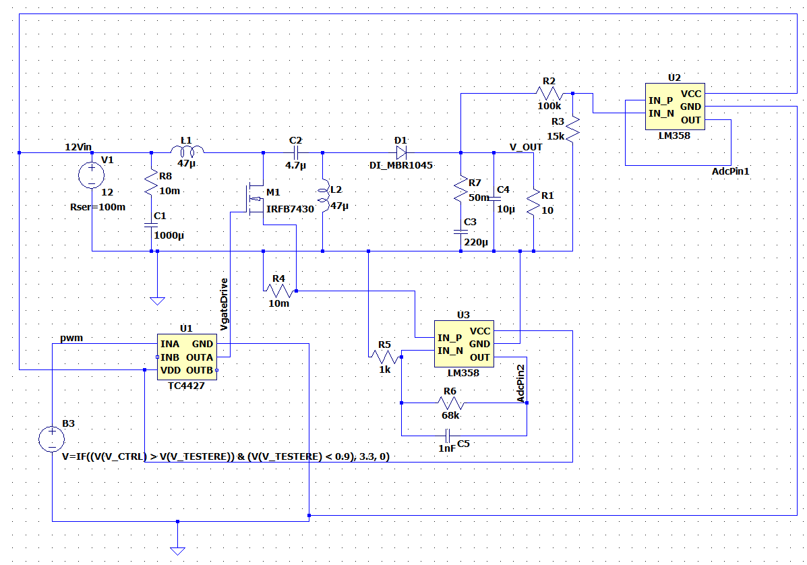
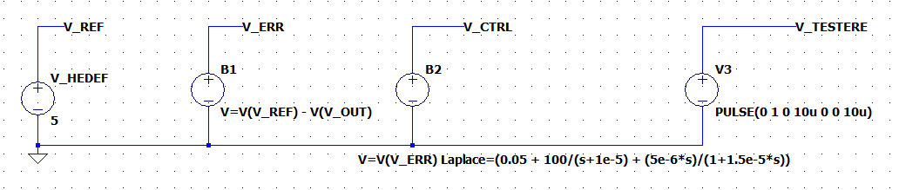
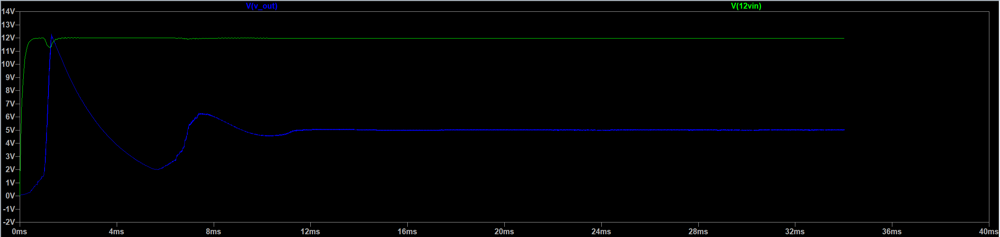

# STM32 Kontrollü SEPIC Güç Dönüştürücü (Öğrenci Projesi)

Bu repo, güç elektroniği ve kontrol teorisi konseptlerini birleştirerek pratik bir donanıma dönüştürmeyi amaçlayan kişisel bir mühendislik projesidir. Temel hedef, geniş giriş voltajı aralıklarında çalışabilen, yazılım tabanlı (STM32) PID kontrolüne sahip bir SEPIC dönüştürücünün önce LTspice üzerinde matematiksel sınırlarını görmek, ardından gerçek donanımını inşa etmektir.

## 1. Güç Katı ve Donanım Mimarisi
Aşağıdaki şema, SEPIC topolojisinin güç katını ve temel geri besleme (feedback) yapısını göstermektedir. Sistemi mikrodenetleyici ile güvenli bir şekilde sürebilmek için **TC4427** gate sürücü entegresi kullanıldı. Akım ve gerilim okumaları ise **LM358** op-ampları ile STM32'nin ADC pinlerine uygun seviyelere çekildi.

## 2. Matematiksel Modelleme ve Kontrolcü Tasarımı
SEPIC dönüştürücüler 4. dereceden non-lineer sistemler olduğu ve sağ yarı düzlem sıfırı (RHPZ) barındırdığı için, sadece deneme-yanılma ile kontrol edilmeleri oldukça zordur. Bu projede işin teorik kısmına inilerek, sistemin transfer fonksiyonuna uygun bir **Type-II/III Kompansatör** mantığı araştırılmış ve LTspice üzerinde s-domain (Laplace) denklemleriyle modellenmiştir.

## 3. Geçici Hal Yanıtı (Transient Response)
Aşağıdaki simülasyon çıktısında, sisteme aniden 12V giriş (Step Input) uygulandığında donanımın verdiği fiziksel tepki ve PID kontrolcünün davranışı incelenmiştir.
* Simülasyonun ilk milisaniyelerinde, SEPIC topolojisindeki uçan kondansatörün (flying capacitor) dolması sırasında oluşan doğal **Inrush Current (Başlangıç Şoku)** nedeniyle voltaj anlık olarak yükseliyor.
* Kontrolcü bu durumu yakalayarak PWM'i (Duty Cycle) %0'a çekiyor.
* Sistem yaklaşık 11. milisaniyede hedeflediğimiz **5V** seviyesine başarıyla oturarak regülasyonu sağlıyor.

---
*Not: Bu simülasyon aşaması, işin "yazılım-donanım takasını" (hardware vs. software trade-off) analiz etmek için yapılmıştır. İlerleyen aşamalarda KiCad ile PCB tasarımı yapılacak ve gerçek dünyadaki komponent toleransları STM32 üzerindeki C tabanlı bir kontrol algoritmasıyla yönetilmeye çalışılacaktır.*